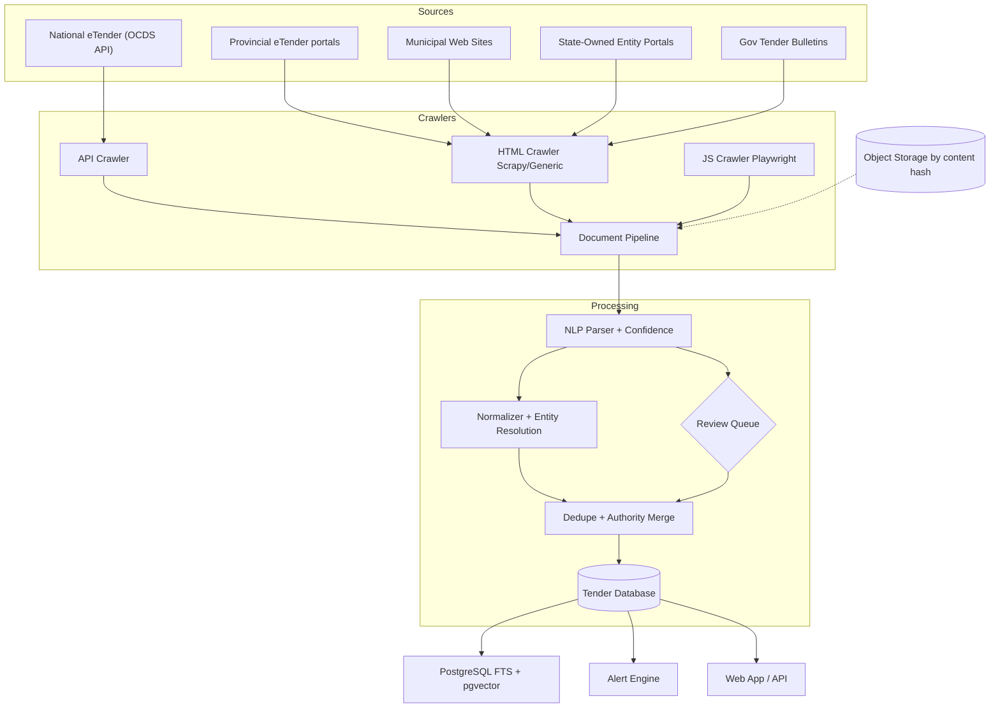
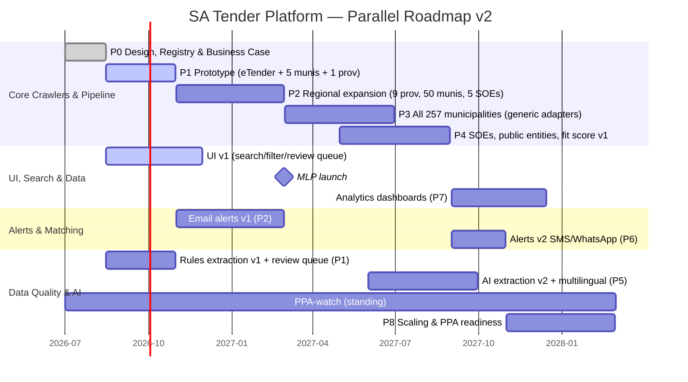

# South African Tender Discovery & Intelligence Platform
## System Blueprint — Version 2.0 (Revised)

| | |
|---|---|
| **Document** | Blueprint v2.0 (supersedes v1.0) |
| **Date** | 14 August 2026 |
| **Status** | Approved for Phase 0/1 planning |
| **Scope** | End-to-end architecture, source strategy, data model, roadmap, risks |

---

## 0. Executive Summary

South Africa's public procurement system spans **nine provinces** and **257 municipalities** (8 metros, 44 district, 205 local), plus hundreds of national departments and state-owned entities (Eskom, Transnet, SANRAL, etc.). The National Treasury's eTender portal (etenders.gov.za) is intended as a **"single point of access"** for all public-sector tenders, but in practice its OCDS-based data covers only those entities that voluntarily share information. Treasury's own Transparency Portal states that its published data **"only includes a subset of public procurement data captured on eTender"** — it excludes most municipal and much SOE procurement. Some provincial governments (e.g. Gauteng, Western Cape, KZN) and major SOEs publish additional tenders on their own portals, and since the Government Tender Bulletin (GTB) failed in February 2021, provinces and municipalities have been legally directed to use alternative media — meaning the *official* channels themselves have fragmented. To achieve truly **complete coverage**, the platform must go beyond official feeds to crawl **every municipality, municipal entity, provincial site, SOE, university, college and other public body**.

This blueprint is a machine-actionable plan for building a **"Google for South African tenders"** that continuously discovers, extracts, normalizes, deduplicates and analyzes procurement notices across all sources. The v2 revision (see §1 for the full changelog) incorporates verified facts about the live eTender Transparency Portal and the pending Public Procurement Act (28 of 2024), a **re-sequenced roadmap that front-loads the revenue-relevant features**, a **generic-adapter strategy** that makes full municipal coverage affordable, a **hardened data model** (timezone-correct dates, compulsory-briefing flag, field provenance and confidence), and an explicit **business case** (§2).

Key components: a comprehensive **Source Registry** of all government organizations; a modular **Crawler Architecture** with source-specific adapters (Scrapy/Playwright for HTML/JS sites, direct API for eTender OCDS, PDF fetchers) plus **generic CMS/sitemap/RSS adapters** to collapse the long tail of municipal sites; a **Document Processing Pipeline** (PDF parsing, OCR, AI-based extraction with confidence scoring); a **Data Model** aligned to the Open Contracting Data Standard (OCDS); intelligent **deduplication and entity resolution**; **source-authority scoring**; **change detection/versioning**; full-text and vector search (PostgreSQL FTS + pgvector); business **fit scoring**; and **alerts** (email first, SMS/WhatsApp later).

The implementation is phased (0–8) with defined deliverables, acceptance criteria and person-month estimates, run as **parallel workstreams** (crawlers / UI / alerts / data-quality) rather than a serial sequence. The **"minimal lovable product"** — eTender + all 9 provinces + 50 municipalities + 5 SOEs, searchable, with email alerts — is targeted for the end of Phase 2 (~Feb 2027). Coverage KPIs are defined against a realistic benchmark: **≥95% of *publishable* tenders** (tenders visible in any accessible channel), measured against the Transparency Portal's published volumes plus sampled municipal audits — not an unachievable "100% of all tenders".

The platform will not only aggregate tenders in near-real time, but transform them into actionable intelligence: summarizing requirements, matching opportunities to supplier profiles, tracking deadline changes, and enabling analytics on historical procurement data. By citing official sources, attributing every field, and adhering to legal/ethical crawling practices (robots.txt, rate limiting, POPIA, content licensing), the system will build trust with users and authorities alike.

---

## 1. What Changed in This Revision (v1 → v2)

| # | v1 issue | v2 fix |
|---|---|---|
| 1 | PPA 28 of 2024 described as "signed, to be proclaimed" with no forward view | §17 documents the live status: assented 18 Jul 2024, published GG 50967, **not yet commenced**, draft General Public Procurement Regulations, 2026 gazetted 16 Apr 2026 (comments closed 15 Jul 2026); a **PPA-watch** standing task and "eTender v2" adapter contingency are added to the roadmap (§20) |
| 2 | eTender OCDS feed treated as a thin, unverified resource | §3 records the verified reality: OCDS downloads since May 2021 under **CC BY 4.0**, REST API with OpenAPI spec, ~158k tenders / ~67k awards / ~5.9k contracts published (as shown Aug 2026) — usable as both live feed and **free historical backfill and coverage benchmark**; Phase 0 task: verify exact API hostname/limits from the spec |
| 3 | KPI typo "258/257 municipalities" | Fixed to 257/257; coverage KPIs redefined entirely (§16) |
| 4 | Roadmap serialized phases over ~2.5 years, contradicting its own "parallel development" note | Re-sequenced: rules-based extraction pulled into P1, basic email alerts into P2, fit-score v1 into P4; roadmap runs as **parallel swimlanes**; **MLP milestone at end of P2** (§20) |
| 5 | 205 local municipalities each needing a bespoke spider | **Generic adapter strategy** (WordPress/Drupal/sitemap/RSS detection) + **discovery-mode triage** of all 257 sources before bespoke work (§5.2); effort estimates for P3 revised upward accordingly (§20) |
| 6 | "100% coverage" and "257/257" acceptance criteria unachievable (many municipalities publish nothing, anywhere — GTB has been broken since 2021) | Coverage redefined as **≥95% of publishable tenders**, measured against the portal benchmark and sampled municipal audits; honest "dark matter" reporting (§3.6, §16) |
| 7 | No business model / market analysis / competitor view | New §2: business model options, competitor landscape (aggregators are both data redundancy *and* rivals), moat definition, content-licensing policy |
| 8 | Data model lacked timezone handling, compulsory-briefing flag, entity resolution, field provenance | §10: `closing_at TIMESTAMPTZ`, `compulsory_briefing` boolean, organisation alias table + reconciliation, per-field `source/confidence` metadata, OCDS field mapping |
| 9 | `requirements` as fixed columns would break under PPA regulatory change | Requirements moved to `jsonb` blob (§10, §11) |
| 10 | No human review path for AI extraction errors | **Review queue** with confidence scores for high-stakes fields (closing dates, values); "verify at source" UI; change alerts on corrections (§6) |
| 11 | No maintenance budget for adapter rot (site redesigns) | Recurring maintenance line added (~10–20% of adapter count per quarter); adapter health on the monitoring dashboard (§15, §20) |
| 12 | No WAF/Cloudflare strategy, no conditional fetching, no crawl state machine | §5: ETag/Last-Modified conditional fetching, defined crawl state machine, polite WAF policy (never bypass), document object storage keyed by content hash |
| 13 | Risk matrix missing the highest-likelihood risks | §19: adds site redesign churn, WAF blocking, LLM extraction errors, PPA commencement, legal reproduction of scraped content, competitive risk, knowledge loss |
| 14 | Metrics lacked operational teeth | §16: adds MTTD/MTTR, alert precision, extraction-confidence coverage, duplicate-rate trend, tiered freshness SLAs |
| 15 | No reference implementations cited | §2.5: OpenOpps (open-source OCDS aggregation) and international full-API systems (UK Contracts Finder, EU TED, NL TenderNed) flagged for reuse evaluation before building from scratch |

---

## 2. Market Context & Business Case

### 2.1 The verified problem

- **eTender is not a single point of access.** The Transparency Portal (data.etenders.gov.za) states its published data "only includes a subset of public procurement data captured on eTender". Municipalities and SOEs are not obliged to share their data.
- **The official bulletin channel is broken.** The GTB (Government Printing Works) has experienced technical difficulties since **4 February 2021**; Treasury invoked PFMA s.79 and directed organs of state to use alternative media. Provinces like the Western Cape now use their own sites as the primary publication channel (e.g. westerncape.gov.za/provincial-treasury/tenders/advertised-cancelled-and-awarded-tenders). The official channels have fragmented — this fragmentation *is* the market opportunity.
- **The market is large.** The eTender Transparency Portal alone displays (as of mid-Aug 2026) approximately **158,000 tenders published** since May 2021 (~30k/year average), **67,000 awards** and **5,900 contracts**, across **~892 procuring entities** and **~1.46M registered suppliers** (CSD-linked). Total market volume including municipal/provincial-only tenders is higher still.
- **The regulatory ground is shifting.** The Public Procurement Act (28 of 2024) is not yet in force, but its draft regulations are in public consultation (see §17.3) and the Act mandates a national technology-based procurement system — meaning the data landscape will change again within the project's lifetime. The platform must be built to survive an "eTender v2".

### 2.2 Competitive landscape and moat

Existing commercial aggregators (e.g. TenderBulletins.co.za and similar) are useful **redundancy sources** (§3.5), but they are also **competitors** — and potentially partners (data licensing or acquisition). They generally cover the easy 20% (eTender + major portals) and lack the long tail, the accuracy guarantees, and the actionable intelligence described here.

The platform's **moat** is a combination of three things competitors rarely combine:

1. **Coverage** — the maintained long tail of municipalities, entities and universities nobody else crawls (protected by the generic-adapter + triage cost structure of §5.2);
2. **Accuracy** — verified fields, per-field provenance, source authority resolution, human review queue, and change detection (protected by the data-quality pipeline of §6);
3. **Actionability** — fit scores, deadline tracking, change alerts, and clean exports (protected by the product features of §13–14).

### 2.3 Business model options

| Option | Description | Notes |
|---|---|---|
| **Free public-good + sponsored** | Free access for all suppliers; costs covered by grants (e.g. donor-funded transparency projects), advertising from procurement-adjacent services | Aligns with the transparency mission; weakest revenue certainty |
| **Freemium** | Free search; paid: advanced filters, unlimited alerts, fit scoring, CSV exports, API access | Most common aggregator model; recommended default |
| **B2B data licensing** | Sell cleaned, deduplicated tender datasets (historical + live) to market-research firms, banks, credit bureaus, equipment lessors | Leverages the historical archive (P7); high margin |
| **Government/entity services** | Sell the crawl+monitoring platform to provinces or municipalities to satisfy their own publication obligations | Attractive post-PPA (Act mandates electronic publication); long sales cycle |
| **Lead-generation** | Charge suppliers a fee per qualified tender contact/warm lead | Works only after fit scoring matures |

**Recommendation:** launch freemium (Phase 2 MLP), add B2B licensing when the historical archive exists (Phase 7), and keep the government-services option on the roadmap as a PPA-triggered opportunity. Executives should sign off on this before Phase 1 to avoid building the wrong product.

### 2.4 Content licensing & data policy

- eTender OCDS data is licensed **CC BY 4.0** — free to build on, with attribution. This covers the highest-value feed.
- **Scraped municipal/provincial content has no license.** Policy: **publish summaries + link to the original; never republish full tender documents or attachments.** Facts (numbers, dates, names) are not copyrightable; verbatim reproduction of documents is risky. This policy is both legally safe and commercially differentiating ("we point you to the source").
- POPIA: no private bidder data stored; only public company/contact information that is clearly published for tender participation.

### 2.5 Reference implementations — reuse before building

- **OpenOpps** (open-source OCDS tender aggregation and analysis platform; deployed by national procurement agencies in several African countries) — evaluate for reuse of the OCDS layer, dedupe, and search UI before writing from scratch.
- **UK Contracts Finder, EU TED API, Netherlands TenderNed** — full public APIs; proof that "official API first" is the right doctrine and free test corpora for the normalizer/dedupe.
- **Open Contracting Partnership** data-quality tooling — for the OCDS mirror layer (§10.5).

---

## 3. Procurement Sources Inventory

South African public-sector tenders are published across many channels. The inventory below is updated with verified portal facts.

### 3.1 National Treasury eTender portal & Transparency Portal

- **eTender** (etenders.gov.za) is the primary portal, intended to cover national, provincial and municipal procurements.
- **Transparency Portal** (data.etenders.gov.za) publishes OCDS-compliant data. **Verified (Aug 2026):** monthly bulk downloads in **CSV, JSON and Excel**, data available **from May 2021**, licensed **CC BY 4.0**; a **versioned JSON REST API** with an **OpenAPI specification** (for PowerBI/Tableau/QlikView consumers); a new **procurement payments dashboard** (BAS + CSD payment data); and displayed counters of ~892 procuring entities, ~1.46M suppliers, ~158k tenders, ~67k awards, ~5.9k contracts. The portal explicitly warns its data is **only a subset** of eTender content.
- **Phase 0 action:** fetch the OpenAPI spec, confirm the exact API base URL and any rate limits/keys, and set up the ingestion harness. This feed is simultaneously: (a) the highest-value live source, (b) a free **historical backfill** of ~158k tenders, and (c) the **coverage benchmark** for everything else.

### 3.2 Provincial eTender portals

Several provinces run their own sites (e.g. Gauteng's Procurement Portal, Western Cape's eProcurement + provincial-treasury tenders page, KZN Provincial Treasury listings). These sometimes publish **before** the national portal and are the *primary* publication channel in some provinces (WC, since 2021). Limpopo/Free State may rely on the national portal — any provincial/agency site should be crawled regardless.

### 3.3 Municipal websites and bulletins

All **257 municipalities** (8 metros + 44 district + 205 local) publish procurement notices, often only on their own websites or local bulletins. Platforms vary: custom CMS, WordPress/Drupal, PDF bulletins, images. The **8 metros** (Buffalo City, City of Cape Town, Ekurhuleni, eThekwini, Johannesburg, Mangaung, Nelson Mandela Bay, Tshwane) are high-volume and mostly crawlable; district/local municipalities are the long tail — see the generic-adapter strategy (§5.2) and the "dark matter" caveat (§3.6).

### 3.4 Government Tender Bulletin (GTB)

The GTB (Government Printing Works) has been **interrupted since February 2021** (GPW technical difficulties from 4 Feb 2021; Treasury instruction invoking PFMA s.79 directing organs of state to alternative media). Historic issues remain useful as a **source of record for closed tenders**; include GTB when available (gov.za/documents/tender), treat as an official aggregator, and don't rely on it for freshness.

### 3.5 SOEs, public entities, universities and third parties

- **SOEs** (Eskom, Transnet, SANRAL, PRASA, Armscor, etc.) operate their own portals or list on eTender; **CIDB's iTenders** covers construction. Catalogue all.
- **Universities, TVET colleges and public entities** (~700 nationwide, incl. hospitals and municipal utilities) publish on procurement pages. Survey and register all.
- **Recognized third-party aggregators** (e.g. TenderBulletins.co.za) are monitored as **redundancy sources** with **lower authority** (§8) — and are also competitors (§2.2).

### 3.6 The "dark matter" caveat

Some municipalities publish **nothing in any accessible channel** — the GTB (their mandated vehicle) has been broken since 2021 and many have no functional website tender section. Such tenders are not reachable by any crawler. The system will:

- target **≥95% of *publishable* tenders** (those visible in at least one accessible channel), not 100% of all tenders;
- **measure and report the dark matter** honestly (audit a sample of municipal SCM offices annually; report an estimated unreachable fraction);
- flag Publish-Nothing sources in the registry for periodic life-sign checks (§5.2).

---

## 4. Master Organization / Source Registry

The **Source Registry** is the master list driving the crawler scheduler. v2 adds authority scoring, triage tiering, and platform detection.

| Field | Description |
|---|---|
| `source_id` | Unique ID (UUID) |
| `name` | Organisation name (e.g. "City of eThekwini Municipality") |
| `type` | Org type (Metro, District, Local, Province, National, SOE, Public Entity, University/TVET, Aggregator) |
| `province` | Province name |
| `municipality` | Municipality code/name (if applicable) |
| `website` / `tender_url` | Base site / specific tenders URL |
| `platform` | Portal system — detected, not guessed: CustomHTML, WordPress, Drupal, Joomla, SitemapOnly, RSS, DocMgmt, OCDS API, PDFOnly, ImageOnly, None |
| `crawl_method` | API / HTML / Playwright / PDF / None |
| `crawl_frequency` | Per triage tier (§5.2) |
| `triage_tier` | 1–4 + `DISCOVERY` + `PUBLISH_NOTHING` |
| `authority_score` | 0–100 (§8) |
| `last_checked` / `last_success` | Timestamps |
| `status` | Active / Degraded / Failed / Publish-Nothing / Inactive |
| `note` | Login required, known WAF issues, contact person, etc. |

**Registry build (Phase 0):** seed from gov.za directories (e.g. gov.za/links/local-government), provincial listings, the Transparency Portal's procuring-entity list (~892 entities), and research ("site:gov.za tenders"). Include primary (official) and secondary (aggregator) sources, each with its authority score. The `platform` field is filled by an automated **platform fingerprinting** step during discovery mode (§5.2).

Example row:

| source_id | name | type | province | municipality | website | tender_url | platform | crawl_method | freq | triage | authority | last_checked | status |
|---|---|---|---|---|---|---|---|---|---|---|---|---|---|
| src-001 | eThekwini Metro Municipality | Metro | KwaZulu-Natal | eThekwini | durban.gov.za | durban.gov.za/tenders | CustomCMS | HTML | 1h | 2 | 95 | 2026-08-14 06:00Z | Active |

---

## 5. Crawler Architecture & Scheduler

### 5.1 Adapter modes

- **API Crawlers:** sources with an API or data download — e.g. the Treasury OCDS REST API (OpenAPI spec; verify endpoint in P0) and provincial JSON/XML feeds. Fetch via Python `requests`/`httpx`, ingest through the Normalizer, and archive raw releases verbatim into `ocds_records`.
- **HTML Crawlers (Scrapy):** most municipal/departmental sites. Scrapy traverses listings, pagination, and search functions. Each source has an adapter; where possible, adapters are **generated from generic templates** (§5.2) rather than hand-written.
- **Browser/JS Crawlers (Playwright):** JavaScript-rendered sites (React/Angular) and login-gated public listings. Scrapy with the Playwright Download Handler renders pages headlessly. **No CAPTCHA-bypass, ever** (§17).
- **Document Fetchers:** linked PDF/DOCX documents are downloaded to **object storage keyed by content hash** (S3/MinIO) — the same bulletin posted on two pages is stored once — and passed to the Document Pipeline (§6). Only public, non-paywalled documents are fetched.

### 5.2 Cost strategy for the long tail: generic adapters + triage

This is the single biggest cost lever in the project. **Do not hand-craft 205 spiders.**

1. **Discovery mode (Phase 3 start):** crawl every unregistered source once (or twice, a week apart) at low frequency. Automatically fingerprint: CMS platform (headers/meta), sitemap.xml, RSS/Atom feeds, JSON-API endpoints, PDF-only sections, or nothing at all.
2. **Generic adapters** — one codebase each, configured per source:
   - *CMS adapter* (WordPress/Drupal/Joomla): use RSS/JSON-API/sitemap when present; fall back to structured listing extraction.
   - *Sitemap/RSS adapter*: pure sitemap.xml/RSS/Atom ingestion — covers a large share of small sites with zero per-site code.
   - *PDF-bulletin adapter*: fetch the single "tenders" PDF, diff content hashes across crawls, parse the bulletin via the Document Pipeline.
3. **Triage:** rank all 257 sources by expected tender volume and format, then allocate: bespoke spiders only for the top ~50 sources by volume; generic adapters for the rest; **Publish-Nothing** sources get a cheap monthly life-sign check (HTTP 200? still nothing? flag for the annual manual audit of §3.6).
4. **Maintenance:** budget ~10–20% of adapter count per quarter for site redesigns/format churn; adapter health is a first-class dashboard metric (§15).

### 5.3 Scheduler, politeness and reliability

- **Tiers:** Tier 1 (eTender OCDS API, major provincial portals): every 15–30 min; Tier 2 (metros, high-traffic sources): 1–2 h; Tier 3 (district/local): 4–6 h; Tier 4 (low activity): daily. Frequencies escalate dynamically when new tenders are found.
- **Politeness:** Scrapy obeys `robots.txt`; per-source rate limits and delays; conditional fetching via **ETag/Last-Modified** and per-URL crawl history (most listing pages don't change — don't re-download them).
- **Queue:** **Celery + Redis** with APScheduler (or Prefect if DAGs/retries are preferred) — decision made here, not left open; the queue is decoupled from the DB (no DB-polling schedulers). Crawl jobs are idempotent and retried with exponential backoff.
- **Crawl state machine:** `PENDING → FETCHING → PARSING → DONE | FAILED | RETRY_BACKOFF`; results are written to an **append-only `crawl_results` log** (never overwritten) so old HTML can be replayed and re-extracted when rules improve.
- **WAF/IP-blocking plan:** several municipal sites sit behind Cloudflare/WAFs. Policy: polite UA, contact-info header, retry with backoff, respect 429/403, and flag "needs Playwright + human check" sources. **Never bypass WAFs or CAPTCHAs.**

### 5.4 Flow



**Example workflow:** a generic CMS adapter for a municipal site detects WordPress, subscribes to its RSS feed, extracts each tender row (title, number, dates) plus the link to the PDF; the PDF is stored by content hash and passed to the Document Pipeline; extracted fields are scored for confidence; high-stakes low-confidence fields (e.g. closing date) go to the Review Queue; the Normalizer resolves the buyer against the organisation registry; the Dedupe stage merges with any eTender copy of the same tender (authority resolution: eTender wins); a new version is recorded if anything changed.

---

## 6. Document Intelligence Pipeline (PDF, OCR, AI Extraction)

- **Extraction:** PyMuPDF/pdfplumber for text-based PDFs; python-docx/Pandoc for Word; **OCRmyPDF + Tesseract** (or PaddleOCR) for scanned PDFs — textless PDFs are auto-detected and OCR'd; OCR output is cached as extracted text alongside the stored object.
- **Cleaning & segmentation:** header/footer removal, whitespace unification, table-cell segmentation.
- **Field extraction with confidence:** regex/NLP rules (spaCy) find tender number, buyer, dates, CIDB grades, B-BBEE levels, mandatory documents, submission method. **Every extracted field carries a confidence score and provenance** (`SOURCE` = parsed from structured data; `DERIVED` = computed; `INFERRED` = guessed by model) — see §10.
- **Human review queue (first-class component):** fields where confidence is below threshold — especially **closing date/time, values, CIDB/BEE requirements** — are queued for human confirmation in an admin UI. An unverified closing date is never silently used to fire user alerts; the UI shows "verify at source" instead.
- **Categorization & summaries:** keyword/classifier-based category tags (construction, ICT, security, …) at ingestion; LLM-generated scope summaries and semantic categories arrive with Phase 5 enhancements (§20).
- **Validation:** extracted closing date must be ≥ published date; value sanity checks; flag anomalies for review.
- **Doctrine (unchanged from v1, reinforced):** the crawler is **deterministic**; AI is used **only downstream** of download, never to decide what to crawl. All LLM output is treated as draft metadata, never as crawl decisions.

---

## 7. Deduplication, Fingerprinting & Entity Resolution

- **Tender-number normalization as a spec'd, tested function:** define canonicalization rules (casefold; strip spaces/punctuation/slashes; map common prefixes: "SCM 045/2026" ≡ "SCM45/2026") as a pure function with a fixture corpus of real SA tender numbers. This is the backbone of dedupe — build it early, test it continuously.
- **Fingerprints:** hash of normalized (buyer id + tender number + title + closing date). Also a document-level hash (content hash) for bulletin PDFs.
- **Fuzzy matching:** title similarity (edit distance / token overlap) to catch differently-formatted duplicates; blocked on (buyer, province, closing month) to stay cheap.
- **Canonical record:** one record per real tender, tracking multiple source URLs and versions; conflicts resolved by **source authority** (§8) and flagged for admins.
- **Entity resolution (new in v2):** "eThekwini Municipality" / "eThekwini Metropolitan Municipality" / "City of eThekwini" must collapse into one organisation. An **`organisation_aliases`** table plus a reconciliation step (dedupe applied to buyers) is required; organisation hierarchy (province → district → local) supports roll-up analytics.
- **Duplicate-rate trend KPI:** % of new records merged as duplicates per week — rising then plateauing is the signal dedupe is working (§16).

---

## 8. Source Authority Scoring & Conflict Resolution

Authority scores (0–100) resolve conflicts and rank results:

| Source type | Score |
|---|---|
| Official national/provincial portal or Government Bulletin | 100 |
| Official municipality portal / SOE portal | 95 |
| University / public entity official site | 90 |
| Recognized tender aggregator (private) | 70 |
| Search-engine discovery / third-party site | 50 |

When a tender appears on multiple sources, highest-authority fields prevail (e.g. eTender says closing 30 Sep, aggregator says 28 Sep → eTender wins). Conflicts are **logged and surfaced** to admins and, where material, to users ("closing date per source A; source B disagrees"). All source attribution is retained per field (§10 provenance); canonical values are shown with notes when needed.

---

## 9. Change Detection & Versioning

- **Version history:** every crawl compares extracted fields to the current record; any change creates a new version entry (full history retained). Document changes are detected by content hash.
- **Change alerts:** automatically classify changes — closing date extended, addendum added, cancellation, re-advertisement with new reference number — and mark status (`EXTENDED`, `CANCELLED`, `RE-ADVERTISED`).
- **User notifications:** tracked/saved tenders notify on change ("closing date extended from 15 Sep to 1 Oct").
- **Audit trail:** crawl timestamp, field diffs, and trigger cause per version; enables recovery if a site reverts content.

---

## 10. Data Model & Status Semantics

### 10.1 Tender record (v2 schema)

```json
{
  "tender_id": "uuid-1234",
  "tender_number": "SCM 045/2026",
  "normalized_tender_number": "scm0452026",
  "title": "Supply and Installation of CCTV System",
  "description": "Supply, installation and 36-month maintenance of CCTV systems at Durban facilities.",
  "buyer": { "id": "org-678", "name": "eThekwini Metropolitan Municipality" },
  "location": {
    "province": "KwaZulu-Natal",
    "district": "eThekwini",
    "municipality": "eThekwini Metro"
  },
  "dates": {
    "published_at": "2026-08-01T08:00:00+02:00",
    "closing_at": "2026-09-15T11:00:00+02:00",
    "briefing_at": "2026-08-20T10:00:00+02:00",
    "compulsory_briefing": true
  },
  "status": "OPEN",
  "values": {
    "estimated": 1200000.00,
    "currency": "ZAR"
  },
  "requirements": {
    "cidb_grades": ["7CE", "6GB"],
    "bbee_required": "Level 2",
    "mandatory_documents": ["Company Registration", "Tax Clearance", "CSD Report"]
  },
  "documents": [
    {
      "url": "https://durban.gov.za/tenders/CCTV-Documents.pdf",
      "filename": "CCTV-Documents.pdf",
      "content_hash": "a1b2c3d4...",
      "object_key": "docs/a1/b2/a1b2c3d4.pdf",
      "version": "v1"
    }
  ],
  "contact": { "email": "scm@durban.gov.za", "phone": "+27-31-1234567" },
  "original_url": "https://durban.gov.za/tenders/CCTV",
  "source_urls": ["https://durban.gov.za/tenders/CCTV", "https://etenders.gov.za/.../SCM0452026"],
  "categories": ["security", "electronics"],
  "field_provenance": {
    "dates.closing_at": { "source": "SOURCE", "source_id": "src-001", "confidence": 0.98 },
    "values.estimated": { "source": "INFERRED", "source_id": "src-001", "confidence": 0.55 }
  }
}
```

### 10.2 v2 schema decisions (from the review)

1. **Timezone-correct instants:** `published_at` / `closing_at` / `briefing_at` are `TIMESTAMPTZ` (SAST +02:00) — never bare date strings — so "closing soon" logic is unambiguous. A closing date with no time is stored with the SCM convention (11:00 SAST) and flagged `INFERRED`.
2. **`compulsory_briefing` boolean:** missing a compulsory briefing = automatic disqualification; one of the highest-value fields in the system.
3. **Estimated value is sparse:** many tenders publish no value; schema marks `estimated` nullable and the UI never pretends otherwise (fit scoring handles nulls — §13).
4. **`requirements` as `jsonb`:** CIDB grades (array), B-BBEE, mandatory documents live in a flexible blob so the PPA transition (new regulations, possibly new BEE rules) never requires a schema migration.
5. **Field provenance:** every field carries `source` (SOURCE/DERIVED/INFERRED), `source_id`, `confidence` — the trust story made concrete, and the fuel for the review queue (§6).
6. **OCDS alignment with an explicit mapping:** field-by-field map (this schema ↔ OCDS `compiledRelease` stages planning/tender/award/contract). Raw OCDS releases are archived verbatim in `ocds_records`; canonical records are **derived** from them, preserving auditability and enabling re-derivation if the model changes.

### 10.3 Status values and the CLOSING_SOON rule

Statuses: `NEW`, `OPEN`, `CLOSING_SOON`, `CLOSED`, `EXTENDED`, `CANCELLED`, `AWARDED`, `RE-ADVERTISED`, `UNKNOWN`.

- `CLOSING_SOON` is **computed**: closing within 72 hours of *verified* `closing_at`.
- If the closing date is unverified (confidence below threshold / no date found), status is `UNKNOWN` and the UI shows "verify at source" — **an unverified date never silently drives alerts**.

### 10.4 Entities

`Tender`, `Buyer/Organisation` (+ aliases, hierarchy), `Supplier`, `Award`, `Contract`, `Document`, `Version`, `Source`, `User`, `Company`, `Alert`, `ReviewItem`.

---

## 11. Database Schema (Tables)

| Table | Fields (sample) |
|---|---|
| **organisations** | id, name, type, province, municipality, parent_org_id, website |
| **organisation_aliases** | id, org_id, alias (normalized), active |
| **sources** | id, org_id (FK), crawl_url, platform, crawl_method, triage_tier, authority_score, frequency, last_checked, last_success, status, note |
| **tenders** | id, tender_number, normalized_tender_number, title, description, buyer_id, status, published_at, closing_at, briefing_at, compulsory_briefing, value_estimated, currency, requirements (jsonb), categories (jsonb), field_provenance (jsonb), search_vector (tsvector), created_at, updated_at |
| **tender_documents** | id, tender_id, doc_url, filename, content_hash, object_key, version |
| **tender_versions** | id, tender_id, version_no, changes (jsonb), detected_at |
| **awards** | id, tender_id, supplier_id, award_date, amount, currency |
| **suppliers** | id, name, registration_no, contact |
| **ocds_records** | id, ocds_id, stage, raw (jsonb), fetched_at |
| **tender_embeddings** | tender_id, model, embedding (vector) |
| **users** | id, name, email, password_hash, role |
| **companies** | id, user_id (owner), name, industry, regions, cidb_grades, bbee_level |
| **user_alerts** | id, user_id, keywords, provinces, categories, min_match_score, channels, batch_prefs, active |
| **alert_events** | id, alert_id, tender_id, channel, sent_at, clicked_at |
| **crawl_jobs** | id, source_id, run_time, state, attempts, next_retry_at, status |
| **crawl_results** | id, job_id, raw (jsonb), extracted_fields (jsonb), fetched_at — **append-only** |
| **source_health** | id, source_id, last_success, last_error, status_code, mttd_started_at |
| **review_queue** | id, tender_id, field, value, confidence, reviewed_by, resolved_at |
| **audit_logs** | id, table_name, record_id, action, timestamp, user_id |

Note: `tender_embeddings` uses **pgvector**; add **postgis** later only if spatial queries are needed.

---

## 12. Search Indexing & Query Strategy

- **Structured filters:** province, municipality, closing window, tender type, CIDB grades, B-BBEE level, categories, status.
- **Full-text search:** PostgreSQL FTS on title, description, extracted document text. Add a **multilingual synonym dictionary** (English/Afrikaans/isiZulu: "construction" ↔ "bou" ↔ "ukwakhiwa") — tender notices are multilingual and bilingual search is table stakes.
- **Vector search:** pgvector embeddings of tender text; semantic recall ("access control systems" finds "biometric entry"). OpenSearch/Elasticsearch is the documented scale-out path if needed.
- **Ranking:** keyword match + vector cosine + authority boost for official sources; keyword highlighting; results sorted by match score and deadline.

---

## 13. Business Matching & Fit Scoring

A company profile (industry keywords, operating regions, CIDB grades, B-BBEE level, max project size) drives a **Fit Score (0–100)**:

```
Fit Score: 88/100 — Excellent match
• Industry match: 100%
• Location: 90%
• CIDB requirement: 80%
• BBBEE match: 95%
• Deadline urgency: 85%
```

- **Weighted composite:** industry (semantic similarity) + geography (operating regions vs. tender location) + requirements (CIDB/BEE vs. profile credentials; missing credential = deduction) + deadline feasibility (urgency discount) + historical win rate (starts at 0; enabled only once award data accumulates).
- **Honesty about data sparsity:** estimated values and BEE/CIDB fields are frequently missing or inferred — the score is computed from what exists and **shows its confidence** ("value-based components not scored: no estimated value published").
- **Scope:** fit-score v1 (rules + embeddings) ships in **Phase 4**; v2 (win-rate learning, value matching) after Phase 7 data accumulates.

---

## 14. Alerts & Notification Design

- **v1 (Phase 2):** email alerts on saved searches (keywords + region + categories + min fit threshold + closing window). Daily digest + immediate alerts for high-match/urgent items. **Batching** to avoid spam; per-alert pause.
- **v2 (Phase 6):** SMS/WhatsApp channels, team integrations (Slack/MS Teams), change alerts on tracked tenders, richer digests.
- **Design principles:** the alert engine reads from the normalized tender table (never the raw queue); **unverified dates never trigger deadline alerts** (§6, §10.3); alert precision (share of notifications acted on) is a tracked KPI (§16).

---

## 15. Monitoring & Source Health Dashboard

- **Coverage:** sources registered vs. actively publishing vs. failing; Publish-Nothing sources tracked separately.
- **Freshness:** per-source time since last successful crawl; publish-to-ingest latency, tiered SLAs (§16).
- **Crawl stats (24h):** pages fetched, documents processed, new tenders, updates detected, errors.
- **Adapter health / rot:** per-adapter success trend and parse-failure rate — site redesigns surface here before they silently kill a source. MTTD/MTTR tracked.
- **Sample view:**

| Source | Type | Freq | Last Check | Status | Notes |
|---|---|---|---|---|---|
| Treasury eTender API | National API | 15 min | 2026-08-14 19:15 | 🟢 OK | 23 new tenders |
| eThekwini Municipality | Municipal | 1h | 2026-08-14 18:50 | 🟢 OK | 5 new, 2 updated |
| City of X | Municipal | 4h | 2026-08-13 14:00 | 🔴 Fail | HTTP 500 (site down) |
| Local Mun. Y | Municipal | 6h | 2026-08-14 17:00 | ⚪ N/A | Publish-Nothing (monthly check) |

**The dashboard must page someone.** A health dashboard nobody gets alerted on is decoration; add alerting on source breakage (with MTTD KPI).

---

## 16. Metrics & KPIs

| KPI | Definition | Target |
|---|---|---|
| **Source coverage** | (a) sources in registry, (b) actively publishing, (c) successfully crawled in last SLA window | 100% of known sources registered; **≥95% of *publishable* tenders captured**; (c) ≥95% per tier |
| **Coverage benchmark** | Weekly captured volume vs. Transparency Portal published volume + sampled municipal audits | ≥80–90% of portal weekly volume **plus** municipal/provincial-only tenders |
| **Dark matter** | Estimated share of tenders unreachable via any channel (annual sampled audit) | Reported honestly; not hidden |
| **Freshness** | Publish-to-ingest delay per tier | T1 ≤ 30 min; T2 ≤ 2 h; T3 ≤ 6 h; T4 ≤ 24 h |
| **Discovery rate** | New tenders per day/week | Tracked; plateau = coverage signal |
| **Duplicate rate trend** | % of new records merged as duplicates per week | Rising → plateauing = dedupe effective |
| **Extraction accuracy** | Field accuracy vs. **gold corpus** (500 hand-verified tenders, re-scored quarterly) | >90%; **high-confidence closing dates on ≥90% of tenders** |
| **MTTD / MTTR** | Mean time to detect / repair a broken source | MTTD < 4 h for T1/T2; MTTR < 24 h |
| **Alert precision** | % of notifications acted on / clicked | Tracked; drives fit-score tuning |
| **System uptime / errors** | Successful crawl jobs %; failures/day | ≥99% job success; failures alerted |
| **User metrics** (post-launch) | Alerts sent, click-through, saved searches, retention | Baseline in P2 |

---

## 17. Legal & Ethical Considerations

### 17.1 Crawling ethics (unchanged, reinforced)

Respect `robots.txt` (Scrapy default); polite rate limits; obey terms of use; no authenticated/paywalled areas; **no CAPTCHA or WAF bypass**; official APIs first (OCDS API, RSS); attribution of every record to its original source URL.

### 17.2 Privacy & content

POPIA: no private bidder data; public company contacts only. Content policy: summaries + links, never full reproduction of scraped documents; eTender data used under **CC BY 4.0** (§2.4).

### 17.3 Regulatory status — verified (Aug 2026)

- **Public Procurement Act, 28 of 2024:** assented 18 July 2024; published in GG 50967 on 23 July 2024; **not yet commenced**. s.69 provides for commencement by Presidential proclamation, potentially **phased** with different dates for different categories of institutions (national/provincial departments vs. municipalities).
- **Draft General Public Procurement Regulations, 2026** were published in GG 54528 on **16 April 2026** for comment; the comment period was extended to **15 July 2026**. Regulations are the prerequisite for commencement.
- The Act establishes a **Public Procurement Office** and a **Public Procurement Tribunal**, and mandates a **national technology-based procurement system** — i.e., **eTender itself may be replaced or upgraded**. PFMA/MFMA/PPPFA remain in force until commencement.
- **Implications for the platform:** (a) keep adapters swappable; (b) keep `requirements` as `jsonb` so new mandatory fields need no migration; (c) a standing **PPA-watch** task monitors GG proclamations and the final regulations; (d) plan an "eTender v2" adapter as a contingency; (e) new electronic-publication obligations may *increase* the pool of machine-readable tenders — a tailwind.

---

## 18. Technology Stack (Decided)

- **Backend/crawlers:** Python; **Scrapy** (HTML/XML/CSV) + **Playwright** (JS-heavy); generic adapters per §5.2. **HTTPX/Requests**.
- **Documents:** PyMuPDF, pdfplumber, python-docx, Pandoc; **OCRmyPDF + Tesseract/PaddleOCR**; object storage **S3/MinIO** keyed by content hash.
- **Data processing:** pandas, spaCy; LLM/embedding APIs (OpenAI/HuggingFace) downstream only.
- **Database:** PostgreSQL + **pgvector** (+ postgis only if spatial needed). Supabase optional for DB/auth.
- **Queue/scheduler:** **Celery + Redis + APScheduler** (or Prefect for DAG-heavy needs) — decided, not open.
- **Search:** PostgreSQL FTS first; OpenSearch/Elasticsearch as the scale-out path.
- **API:** FastAPI. **Frontend:** Next.js (React, TypeScript).
- **Notifications:** SMTP/SendGrid (email first), Twilio (SMS/WhatsApp later), webhooks (Slack/MS Teams).
- **Hosting:** AWS/GCP/Azure; Docker/Kubernetes.
- **Reuse evaluation:** OpenOpps and OCP tooling before building the OCDS layer from scratch (§2.5).

---

## 19. Risk Matrix (v2)

| Risk | Likelihood | Impact | Mitigation |
|---|---|---|---|
| **Site redesign / format churn** breaks adapters (municipal sites redesign often) | **High** | Medium | Generic adapters (CMS/sitemap/RSS) reduce exposure; per-adapter golden-fixture tests; adapter-health dashboard; maintenance budget (~10–20% of adapters/quarter) |
| **Source unavailability** (site down) | High | High | Retry/backoff; health monitoring with alerting; alternate sources; contact info for long outages |
| **WAF / Cloudflare blocking** | Medium | Medium | Polite UA, retry/backoff, Playwright fallback, flag-for-human policy; never bypass |
| **LLM/rule extraction errors (e.g. wrong closing date)** | Medium | **High** (bidder misses deadline) | Confidence scores; review queue for high-stakes fields; "verify at source" UI; change alerts on corrections |
| **Duplicate/conflicting data** | Medium | Medium | Fingerprinting + entity resolution + source authority; log conflicts for review |
| **PPA commencement changes the landscape** (new national system, new mandatory fields) | Medium-High | Medium | Swappable adapters; `requirements` as jsonb; PPA-watch task; "eTender v2" adapter contingency |
| **Legal exposure from republishing scraped content** | Low | High | Summaries + links only; CC BY 4.0 covers eTender data; POPIA data-processing register; legal review before launch |
| **Scaling issues (performance)** | Medium-High | Medium | Modular system; queues; load testing; pgvector + FTS; OpenSearch path |
| **Competitor beats us to market** | Medium | High | Compress P0–P2 to MLP by Feb 2027; lead with coverage + accuracy + attribution |
| **Knowledge loss when adapter authors leave** | Medium | Medium | Adapter contract = fixtures + docs; every spider ships with recorded sample pages and expected output |
| **Regulatory changes beyond PPA** | Low | Medium | Monitor legal updates; keep schema flexible (jsonb); annual legal review |
| **Scope creep** | Low-Med | Medium | Stick to core goal (tenders); MVP-first prioritization |

---

## 20. Phased Roadmap (v2 — parallel workstreams)

**Planning notes:** (a) phases run as **parallel swimlanes** (crawlers / UI / alerts / data-quality) rather than serially; (b) effort is in person-months (build only); (c) **recurring maintenance** of ~10–20% of adapter count per quarter (≈1–2 PM/month at steady state) is budgeted separately from build estimates; (d) a standing **PPA-watch** task (monitoring GG proclamations and final regulations) runs from P0 onward.

| Phase | Deliverables | Acceptance criteria | Effort (PM) | Priority |
|---|---|---|---|---|
| **0: Requirements, Design & Business Validation** | Data model v2 (this doc); source registry seed (eTender OCDS endpoint verified from OpenAPI spec; 3 municipalities; 9 provinces); architecture; business model sign-off (§2); PPA-watch setup | Data model documented; registry seeded; OCDS API endpoint/limits confirmed; business model approved | 2–4 | High |
| **1: Prototype (Core Crawler + Rules Extraction)** | eTender OCDS ingestor + 5 municipalities + 1 province + GTB historic; **rules-based extraction v1 with confidence scores**; dedupe + entity resolution on overlaps; basic search/filter UI; review-queue skeleton | Sample tenders from all sources ingested; dedupe merges cross-source duplicates; extraction confidence attached to fields; UI shows tenders with source attribution | 4–7 | High |
| **2: Regional Expansion + Basic Alerts → MLP** | 9 provinces + 50 municipalities (metros & districts) + 5 SOEs; generic CMS/sitemap adapters live; **email alerts v1**; source-health dashboard with alerting | **MLP achieved:** eTender + 9 provinces + 50 munis + 5 SOEs crawling reliably; searchable UI; email alerts working; dashboard monitoring >80% of sources; ~5k tenders collected | 8–11 | High |
| **3: Full Municipal Coverage** | Discovery-mode triage of all 257 sources; generic adapters; remaining municipalities (total 257) | **≥95% of *publishable* tenders captured** (portal-benchmark + sampled audit); 257/257 sources in registry; Publish-Nothing sources identified and flagged | 10–14 | High |
| **4: Complete Public-Sector Coverage + Fit Score v1** | Remaining SOEs, public entities (~700), universities, TVETs; **fit-score v1** (rules + embeddings) | Major SOEs/universities integrated; tender volume plateau indicates coverage; company profiles return relevant matches with scores | 6–9 | Medium |
| **5: AI Extraction & Classification v2** | LLM summaries, semantic categories, cross-language search upgrade; extraction accuracy vs. gold corpus | Field accuracy >90% on gold corpus; high-confidence closing dates ≥90%; summaries on 90% of tenders; multilingual synonyms live | 4–6 | Medium |
| **6: Alerts & User Features v2** | SMS/WhatsApp, team integrations, change alerts, fit-score v2 (win-rate learning) | Multi-channel alerts tested; change-alert flows live; fit-score precision measured | 3–5 | Medium |
| **7: Analytics & Historical BI** | Historical archive; procurement analytics (monthly counts, category trends, award benchmarks); B2B dataset licensing readiness | Historical trends accessible; analytics dashboards live; export/API offerings defined | 4–6 | Low |
| **8: Refinement, Scaling & PPA Readiness** | Performance tuning; production infra; **"eTender v2" adapter contingency**; compliance review (PPA regs final, POPIA register) | 100k+ tenders at acceptable latency; SLAs/ops docs; PPA-readiness checklist complete | 4–6 | Low |

**Total build effort: ~45–68 PM** (+ recurring maintenance from P2 onward). With a 3–5 person team running parallel workstreams, the MLP lands **end of Phase 2 (~Feb 2027)** and full scope by **~Q1 2028** — roughly half the calendar time of the v1 serial plan.



**Phase transition rules:** each phase must demonstrate its acceptance criteria with automated tests; phase exits require >95% of planned sources active and data-volume targets met (defined per phase against the portal benchmark).

---

## 21. Example JSON Schemas (v2)

Tender record: see §10.1 (updated). Crawler job payload (v2 — state machine + policy fields):

```json
{
  "job_id": "job-7890",
  "source": {
    "id": "src-001",
    "name": "City of eThekwini",
    "type": "Metro",
    "triage_tier": 2,
    "crawl_url": "https://durban.gov.za/tenders",
    "adapter": "generic_cms"
  },
  "schedule": {
    "scheduled_time": "2026-08-14T18:00:00Z",
    "last_run": "2026-08-14T12:00:00Z",
    "frequency_min": 60
  },
  "policy": {
    "robots_txt": "obey",
    "rate_limit_per_min": 12,
    "conditional_fetch": true
  },
  "actions": [
    { "action": "fetch_listing", "params": {} },
    { "action": "fetch_documents", "params": { "pattern": "pdf", "store_by_hash": true } }
  ],
  "state": "PENDING",
  "attempts": 0,
  "next_retry_at": null
}
```

---

## 22. References

- National Treasury eTender Transparency Portal — OCDS downloads (CSV/JSON/Excel, since May 2021, CC BY 4.0), REST API (OpenAPI), payment dashboard, "subset of data" disclaimer, live counters: https://data.etenders.gov.za/
- Local government overview, gov.za — 257 municipalities (8/44/205): https://www.gov.za/about-government/government-system/local-government
- Public Procurement Act, 28 of 2024 — assented 18 Jul 2024, published GG 50967, not commenced, s.69 phased commencement: https://lawlibrary.org.za/akn/za/act/2024/28/eng@2024-07-23
- Draft General Public Procurement Regulations, 2026 — GG 54528 (16 Apr 2026); comment extended to 15 Jul 2026: https://www.sanews.gov.za/south-africa/public-comment-period-draft-public-procurement-regulations-extended
- National Treasury media statement — commencement of the Public Procurement Act (13 Aug 2024): https://www.treasury.gov.za/comm_media/press/2024/2024081301%20Media%20Statement%20-%20Commencement%20of%20Public%20Procurement%20Act.pdf
- Western Cape Government — GTB/eTender technical difficulties since Feb 2021; provincial tenders page: https://www.westerncape.gov.za/tenders
- Daily Maverick/GroundUp — "What's gone wrong with government's tender website?" (Jun 2021): https://www.dailymaverick.co.za/article/2021-06-11-whats-gone-wrong-with-governments-tender-website/
- OpenOpps — open-source OCDS tender aggregation platform (reuse evaluation): https://www.openopps.com
- Open Contracting Partnership — OCDS standard and data-quality tooling: https://www.open-contracting.org/
